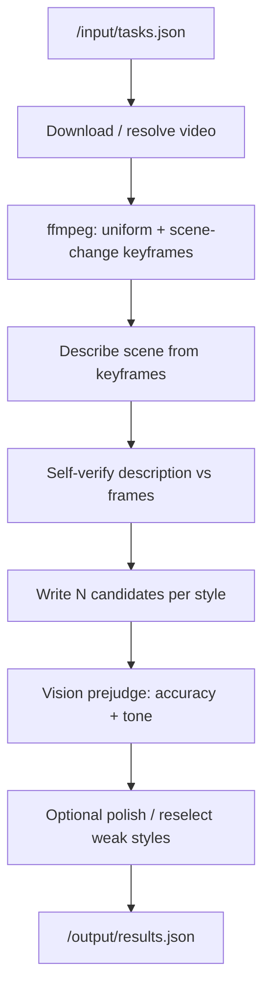

# SEV-Cap — Grounded Multi-Style Video Captioning

Multi-style video captioning for Hackathon **Track 2 (Video Captioning)**. For
every clip it produces four captions — **formal, sarcastic, humorous-tech,
humorous-non-tech** — optimized for the LLM judge’s two axes:

- **Accuracy** — describe → verify → multi-candidate write, with vision
  pre-scoring so the best candidate wins
- **Tone** — style-specific few-shot prompts plus polish/reselect when tone
  or accuracy dips

| | |
| --- | --- |
| **Docker image** | `ghcr.io/skx56/sevcap-grounded:latest` (linux/amd64) |
| **Repository** | <https://github.com/skx56/sev-cap> |
| **Presentation** | [SEV-Cap-Presentation.pdf](SEV-Cap-Presentation.pdf) |

## Four output styles

| Style | What it sounds like |
| --- | --- |
| **Formal** | Clear, professional description of the scene |
| **Sarcastic** | Dry, witty take with a bit of attitude |
| **Humorous · Tech** | Playful joke with a nerdy / tech twist |
| **Humorous · Non-Tech** | Light, everyday humor anyone can follow |

## Architecture



1. **Harness I/O** — read `tasks.json`, write a flat `results.json` array of
   `{task_id, captions}` (Track 2 contract).
2. **Grounded describe → verify** — one shared scene description, checked
   against frames before any styled writing.
3. **Multi-candidate styles** — `SEVCAP_CANDIDATES` drafts per style; a vision
   judge picks the best accuracy+tone pair.
4. **Anytime** — placeholders written early; per-clip timeouts and a global
   budget so the batch never ends with `MISSING_TASKS` / `OUTPUT_MISSING`.

### Models

Default image: **Kimi K2.6** (`accounts/fireworks/models/kimi-k2p6`) via
Fireworks. Override with `SEVCAP_MODEL` / `SEVCAP_VISION_MODEL` for Gemma bonus
mode.

## Results (official AMD sample clips)

Internal judge on the 8 official sample-style clips (combined =
`(mean_acc + mean_tone) / 10`):

| Metric | Score |
| --- | --- |
| Combined (leaderboard-style, 0–1) | **0.975** |

## Quick start

```bash
git clone https://github.com/skx56/sev-cap && cd sev-cap
python3 -m venv .venv && .venv/bin/pip install -e ".[dev]"
export FIREWORKS_API_KEY=fw_...

.venv/bin/sevcap check
.venv/bin/sevcap run -i sample_input -o results
```

### Docker (what the scoring harness runs)

```bash
docker buildx build --platform linux/amd64 -t ghcr.io/skx56/sevcap-grounded:latest .
docker run --rm --platform linux/amd64 \
  -e FIREWORKS_API_KEY=fw_... \
  -v "$PWD/sample_input:/input:ro" -v "$PWD/results:/output" \
  ghcr.io/skx56/sevcap-grounded:latest
```

Expects `/input/tasks.json` and writes `/output/results.json`. Audio ASR is
off by default (`SEVCAP_AUDIO=0`); scoring is vision-grounded.

**Submit this image URI to the harness:** `ghcr.io/skx56/sevcap-grounded:latest`
(not the old `ghcr.io/skx56/sev-cap:latest` package).

### Useful commands

| Command | Purpose |
| --- | --- |
| `sevcap check` | Smoke-test the API key and vision support |
| `sevcap run -i … -o …` | Run the full pipeline |
| `python scripts/validate_harness.py` | Schema / contract checks |
| `python eval/run_eval.py` | Internal accuracy + tone eval |
| `pytest -q` | Offline unit tests |

### Configuration (env vars)

See [.env.example](.env.example): `SEVCAP_CANDIDATES`, `SEVCAP_POLISH`,
`SEVCAP_FRAMES`, `SEVCAP_TIME_BUDGET`, concurrency, and model overrides.

## Tech stack

**Kimi K2.6** (default) · Fireworks AI · Python 3.11 · asyncio · ffmpeg ·
Docker (linux/amd64) · GitHub Actions → ghcr.io

## Docs

- [SEV-Cap-Presentation.pdf](SEV-Cap-Presentation.pdf)
- [docs/slides.md](docs/slides.md), [docs/submission.md](docs/submission.md)
