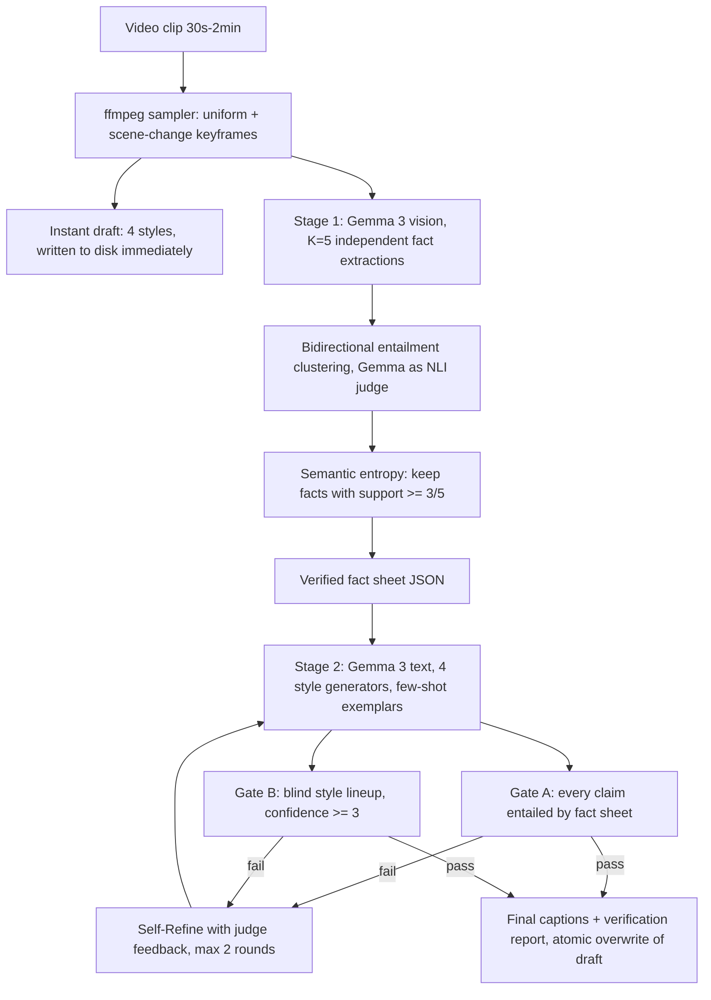

# SEV-Cap — Semantic-Entropy Verified Video Captioning

Multi-style video captioning for Hackathon **Track 2**, built entirely on
**Google Gemma 3 27B** via the Fireworks AI API. For every clip it produces
four captions — **formal, sarcastic, humorous-tech, humorous-non-tech** — and,
crucially, *pre-verifies each one on the same two axes the LLM-Judge grades*:

- **Accuracy** — via **semantic-entropy fact verification**, an adaptation of
  Farquhar et al., *"Detecting hallucinations in large language models using
  semantic entropy"*, **Nature 2024** ([doi:10.1038/s41586-024-07421-0](https://doi.org/10.1038/s41586-024-07421-0))
- **Tone** — via a **blind style lineup**: captions are label-stripped,
  shuffled, and must be re-identified by a fresh judge context, with failed
  captions repaired through a **Self-Refine** loop (Madaan et al., NeurIPS 2023,
  [arXiv:2303.17651](https://arxiv.org/abs/2303.17651))

## Why this is different

Single-pass "VLM watches clip, writes 4 captions" pipelines fail on exactly
two things: hallucinated details and captions whose style label is
aspirational. SEV-Cap attacks both *structurally*:

1. **Facts are sampled, not trusted.** Stage 1 runs **K=5 independent** fact
   extractions over keyframes at temperature 0.7. Facts are clustered by
   **bidirectional entailment** (Gemma judging "A entails B and B entails A"),
   and per-fact support across samples gives a semantic-entropy signal. A fact
   asserted in ≥3/5 independent samples is *verified*; a fact appearing once is
   the arbitrary-confabulation signature the Nature paper detects — it is
   rejected and logged. Recent video-hallucination work (GRAVITI, SEASON,
   SmartSight, 2025) grounds or contrasts decoding, but none applies
   semantic-entropy verification to a captioning fact set.
2. **Captions are generated from the verified fact sheet only** — the
   generator never sees the video, so an unverified detail cannot leak into a
   caption (hallucination firewall).
3. **Gate A (grounding):** each caption's concrete claims must be entailed by
   the fact sheet, or the caption is regenerated with the offending claims as
   feedback.
4. **Gate B (blind lineup):** the four unlabeled, shuffled captions must be
   matched back to their styles by a fresh judge with confidence ≥3/5. A
   "sarcastic" caption that reads as merely declarative loses the lineup and
   gets rewritten with the judge's confusion as Self-Refine feedback.
5. **Anytime output:** a fast draft for all four styles is written to disk the
   moment frames are sampled; the verified pipeline then upgrades it in place
   with atomic writes. A timeout can degrade quality but can never produce
   missing output.

Every clip's JSON ships with a **verification report** — rejected
high-entropy facts, lineup verdicts and confidences, retry history — so the
pipeline shows its receipts.

## Architecture



**One model end-to-end:** `accounts/fireworks/models/gemma-3-27b-it` is the
extractor, the entailment judge, the caption writer, the lineup judge, and the
refiner. Gemma is the engine, not a bolt-on.

## Quick start

```bash
git clone https://github.com/<you>/sev-cap && cd sev-cap
python3 -m venv .venv && .venv/bin/pip install -e ".[dev]"
export FIREWORKS_API_KEY=fw_...

.venv/bin/sevcap check          # verifies key + which model accepts images
./scripts/download_clips.sh     # builds an open-licensed eval set in clips/
.venv/bin/sevcap run -i clips -o results
```

Per-clip output (`results/<clip>.json`), plus a combined `results/captions.json`:

```json
{
  "clip": "bbb_action_45s",
  "captions": {
    "formal": "...",
    "sarcastic": "...",
    "humorous_tech": "...",
    "humorous_non_tech": "..."
  },
  "verification": {
    "stage": "sev-verified",
    "fact_verification": {"semantic_entropy": 1.9, "verified_facts": ["..."], "rejected_high_entropy_facts": ["..."]},
    "style_gates": {"sarcastic": {"lineup_identified_as": "sarcastic", "lineup_confidence": 5, "attempts": 2}}
  }
}
```

### Docker (what the scoring harness runs)

```bash
docker buildx build --platform linux/amd64 -t ghcr.io/<you>/sev-cap:latest .
docker run --rm --platform linux/amd64 \
  -e FIREWORKS_API_KEY=fw_... \
  -v "$PWD/clips:/input:ro" -v "$PWD/results:/output" \
  ghcr.io/<you>/sev-cap:latest
```

The container is argument-free: it discovers clips in `/input` (or
`INPUT_DIR`), writes JSON to `/output` (or `OUTPUT_DIR`), and honors a global
time budget (`SEVCAP_TIME_BUDGET`, default 1500s) as an anytime algorithm.

### Useful commands

| Command | Purpose |
| --- | --- |
| `sevcap check` | Smoke-test the API key and vision support |
| `sevcap facts clips/x.mp4` | Show verified vs rejected facts for one clip |
| `sevcap lineup-test` | Blind-lineup the style exemplars themselves |
| `python eval/run_eval.py` | Full internal eval: accuracy + tone per caption |
| `pytest -q` | Offline unit tests (no API key needed) |

### Configuration (env vars)

See [.env.example](.env.example) for every knob: `SEVCAP_K` (extraction
samples), `SEVCAP_MIN_SUPPORT` (verification threshold), `SEVCAP_FRAMES`,
`SEVCAP_TIME_BUDGET`, `SEVCAP_LINEUP_MIN_CONF`, model overrides, and
concurrency limits. Responses are disk-cached (`.sevcap_cache/`) outside the
container so eval reruns are free.

## Tech stack

**Gemma 3 27B (Google)** · Fireworks AI API · Python 3.11 · asyncio · ffmpeg ·
Docker (linux/amd64)

## References

- S. Farquhar, J. Kossen, L. Kuhn, Y. Gal. *Detecting hallucinations in large
  language models using semantic entropy.* Nature 630, 625-630 (2024).
- A. Madaan et al. *Self-Refine: Iterative Refinement with Self-Feedback.*
  NeurIPS 2023.
- L. Kuhn, Y. Gal, S. Farquhar. *Semantic Uncertainty: Linguistic Invariances
  for Uncertainty Estimation in Natural Language Generation.* ICLR 2023.
- Test footage: Big Buck Bunny & Elephants Dream (Blender Foundation, CC-BY).
