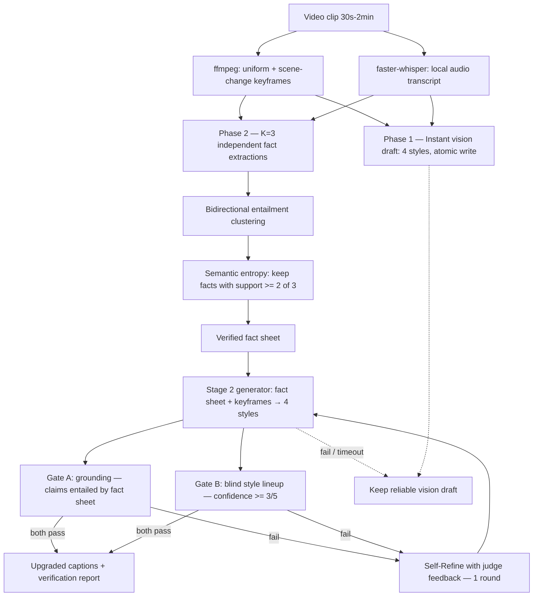

# SEV-Cap — Semantic-Entropy Verified Video Captioning

Multi-style video captioning for Hackathon **Track 2 (Video Captioning)**. For
every clip it produces four captions — **formal, sarcastic, humorous-tech,
humorous-non-tech** — and pre-verifies each one on the same two axes the
LLM-Judge grades:

- **Accuracy** — via **semantic-entropy fact verification**, an adaptation of
  Farquhar et al., *"Detecting hallucinations in large language models using
  semantic entropy"*, **Nature 2024** ([doi:10.1038/s41586-024-07421-0](https://doi.org/10.1038/s41586-024-07421-0))
- **Tone** — via a **blind style lineup**: captions are label-stripped,
  shuffled, and must be re-identified by a fresh judge context, with failed
  captions repaired through a **Self-Refine** loop (Madaan et al., NeurIPS 2023,
  [arXiv:2303.17651](https://arxiv.org/abs/2303.17651))

| | |
| --- | --- |
| **Live demo** | <https://associates-desired-avatar-doctrine.trycloudflare.com> |
| **Docker image** | `ghcr.io/skx56/sev-cap:latest` (linux/amd64) |
| **Repository** | <https://github.com/skx56/sev-cap> |
| **Presentation** | [docs/SEV-Cap-Presentation.pdf](docs/SEV-Cap-Presentation.pdf) (8 pages) |

Upload a short clip in the browser and watch the pipeline produce all four
styles plus a verification report (verified vs. rejected facts). The demo is a
Streamlit app (`demo/app.py`) running the exact production pipeline.

> The demo link is served through a Cloudflare quick-tunnel and may rotate if
> the host restarts; run `demo/app.py` locally for a permanent copy.

## Four output styles

Every clip produces exactly four captions — one per required style:

| Style | What it sounds like |
| --- | --- |
| **Formal** | Clear, professional description of the scene |
| **Sarcastic** | Dry, witty take with a bit of attitude |
| **Humorous · Tech** | Playful joke with a nerdy / tech twist |
| **Humorous · Non-Tech** | Light, everyday humor anyone can follow |

Each style is generated independently, then checked for grounding and tone
before it replaces the fast draft.

## Why this is different

Single-pass "VLM watches clip, writes 4 captions" pipelines fail on exactly
two things: hallucinated details and captions whose style label is
aspirational. SEV-Cap attacks both *structurally*:

1. **Facts are sampled, not trusted.** Stage 1 runs **K=3 independent** fact
   extractions over keyframes (plus the audio transcript). Facts are clustered
   by **bidirectional entailment** ("A entails B and B entails A"), and per-fact
   support across samples gives a semantic-entropy signal. A fact asserted in
   **≥2 of 3** independent samples is *verified*; a fact appearing once is the
   arbitrary-confabulation signature the Nature paper detects — it is rejected
   and logged.
2. **Two independent evidence sources.** Keyframes are sampled with ffmpeg
   (uniform + scene-change) and the audio track is transcribed **locally** with
   `faster-whisper` (CPU, int8, weights baked into the image). Dialogue and
   sound cues become facts the vision stream alone would miss.
3. **Grounded generation with a draft firewall.** A fast vision draft is
   written for every clip immediately (the *anytime* guarantee). The verified
   Stage-2 generator then rewrites all four styles from the verified fact sheet
   **and** the keyframes, and the upgraded captions are only kept if they pass
   both gates — otherwise the reliable draft is retained.
4. **Gate A (grounding):** each caption's concrete claims must be entailed by
   the fact sheet, or the caption is regenerated with the offending claims as
   feedback.
5. **Gate B (blind lineup):** the four unlabeled, shuffled captions must be
   matched back to their styles by a fresh judge with confidence ≥3/5. A
   "sarcastic" caption that reads as merely declarative loses the lineup and
   gets rewritten with the judge's confusion as Self-Refine feedback.
6. **Anytime, timeout-hardened output:** the instant draft is upgraded in place
   with atomic writes, under both a global time budget and a **hard per-clip
   upgrade timeout**. A single stuck clip can never starve the batch or produce
   missing output.

Every clip's JSON ships with a **verification report** — rejected high-entropy
facts, lineup verdicts and confidences, retry history — so the pipeline shows
its receipts.

## Architecture



**Phase 1 (anytime guarantee):** a single vision pass writes all four styles to
disk immediately. From this moment the clip has valid output.

**Phase 2 (SEV upgrade):** independent fact sampling, semantic-entropy
verification, grounded generation with keyframes, dual gates, and one Self-Refine
round. Upgraded captions replace the draft only when they pass **both** Gate A
and Gate B; otherwise the vision-grounded draft is kept.

### Models

The default image runs on **Kimi K2.6** (`accounts/fireworks/models/kimi-k2p6`)
end-to-end via the Fireworks AI API — a strong serverless VLM+text model used as
extractor, entailment judge, caption writer, lineup judge, and refiner.

For the **"Best Use of Gemma"** bonus, the entire pipeline can be pointed at
**Gemma 4 26B** (`gemma-4-26b-a4b-it`, on-demand / scale-to-zero) with a single
env var (`SEVCAP_MODEL` / `SEVCAP_VISION_MODEL`); Kimi stays wired in as an
automatic fallback if the deployment is cold or a call degenerates. One open
model can therefore be the engine and the verifier, end-to-end.

## Results (internal eval)

Full 7-clip internal eval (Big Buck Bunny + Elephants Dream, CC-BY), scored by
an LLM-Judge on accuracy (1–5) and tone (1–5):

| Metric | Score |
| --- | --- |
| Mean accuracy | 3.82 / 5 |
| Mean tone | 4.79 / 5 |
| Combined (leaderboard-style, 0–1) | **0.86** |

## Quick start

```bash
git clone https://github.com/skx56/sev-cap && cd sev-cap
python3 -m venv .venv && .venv/bin/pip install -e ".[dev]"
export FIREWORKS_API_KEY=fw_...

.venv/bin/sevcap check          # verifies key + which model accepts images
./scripts/download_clips.sh     # builds an open-licensed eval set in clips/
.venv/bin/sevcap run -i clips -o results
```

### Run the web demo locally

```bash
.venv/bin/streamlit run demo/app.py --server.port 7860
# then open http://localhost:7860
```

Per-clip output (`results/<clip>.json`), plus a combined `results/captions.json`:

```json
{
  "clip": "bbb_action_45s",
  "captions": {
    "formal": "...",
    "sarcastic": "...",
    "humorous_tech": "...",
    "humorous_non_tech": "..."
  },
  "verification": {
    "stage": "sev-verified",
    "fact_verification": {"semantic_entropy": 1.9, "verified_facts": ["..."], "rejected_high_entropy_facts": ["..."]},
    "style_gates": {"sarcastic": {"lineup_identified_as": "sarcastic", "lineup_confidence": 5, "attempts": 2}}
  }
}
```

### Docker (what the scoring harness runs)

```bash
docker buildx build --platform linux/amd64 -t ghcr.io/skx56/sev-cap:latest .
docker run --rm --platform linux/amd64 \
  -e FIREWORKS_API_KEY=fw_... \
  -v "$PWD/clips:/input:ro" -v "$PWD/results:/output" \
  ghcr.io/skx56/sev-cap:latest
```

The container is argument-free: it discovers clips in `/input` (or
`INPUT_DIR`), writes JSON to `/output` (or `OUTPUT_DIR`), and honors a global
time budget (`SEVCAP_TIME_BUDGET`, default 1800s) plus a per-clip upgrade
timeout as an anytime algorithm. Whisper weights are baked in at build time so
audio transcription needs no extra network access at run time.

### Useful commands

| Command | Purpose |
| --- | --- |
| `sevcap check` | Smoke-test the API key and vision support |
| `sevcap facts clips/x.mp4` | Show verified vs rejected facts for one clip |
| `sevcap lineup-test` | Blind-lineup the style exemplars themselves |
| `python eval/run_eval.py` | Full internal eval: accuracy + tone per caption |
| `pytest -q` | Offline unit tests (no API key needed) |

### Configuration (env vars)

See [.env.example](.env.example) for every knob: `SEVCAP_K` (extraction
samples, default 3), `SEVCAP_MIN_SUPPORT` (verification threshold, default 2),
`SEVCAP_FRAMES`, `SEVCAP_TIME_BUDGET`, `SEVCAP_CLIP_UPGRADE_TIMEOUT`,
`SEVCAP_LINEUP_MIN_CONF`, `SEVCAP_AUDIO` / `SEVCAP_WHISPER_MODEL`, model
overrides, and concurrency limits. Responses are disk-cached (`.sevcap_cache/`)
outside the container so eval reruns are free.

## Tech stack

**Kimi K2.6** (default) · **Gemma 4 26B** (bonus mode) · Fireworks AI API ·
`faster-whisper` (local CPU ASR) · Streamlit (demo) · Python 3.11 · asyncio ·
ffmpeg · Docker (linux/amd64) · GitHub Actions → ghcr.io

## References

- S. Farquhar, J. Kossen, L. Kuhn, Y. Gal. *Detecting hallucinations in large
  language models using semantic entropy.* Nature 630, 625-630 (2024).
- A. Madaan et al. *Self-Refine: Iterative Refinement with Self-Feedback.*
  NeurIPS 2023.
- L. Kuhn, Y. Gal, S. Farquhar. *Semantic Uncertainty: Linguistic Invariances
  for Uncertainty Estimation in Natural Language Generation.* ICLR 2023.
- Test footage: Big Buck Bunny & Elephants Dream (Blender Foundation, CC-BY).
