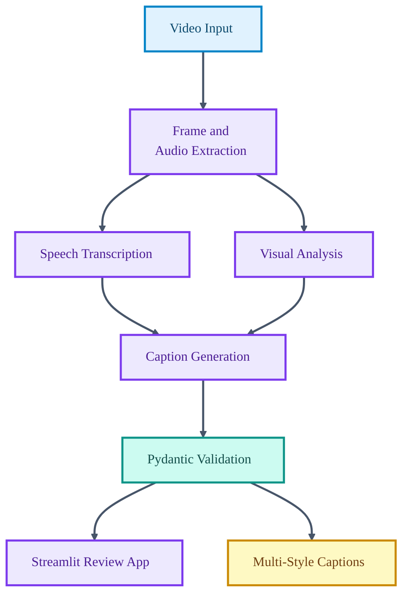

# SEV-Cap

<p align="center">

  
  
  
  
</p>

<p align="center">
  <strong>A semantic-entropy verified video captioning pipeline for producing multi-style captions with confidence-aware validation.</strong>
</p>

SEV-Cap focuses on one of the hardest parts of automated captioning: making generated descriptions useful without hiding uncertainty. It extracts video signals, transcribes audio, generates caption variants, and validates output through schema-backed stages.

## Core Capabilities

- Runs a modular video captioning pipeline from extraction to final caption output.
- Supports transcription, analysis, captioning, and validation stages.
- Exposes an interactive Streamlit application for experimentation.
- Includes Docker and test assets for repeatable evaluation.

## Technical Architecture

The pipeline is split into extraction, transcription, analysis, captioning, and validation modules. Pydantic schemas define data contracts between stages, while the Streamlit app provides a thin interface over the core pipeline.

## Architecture Diagram



## Technology Stack

- Python 3.11 project with pyproject configuration.
- faster-whisper for transcription workflows.
- Pydantic schemas for typed pipeline contracts.
- Streamlit UI for interactive review.
- Docker support for environment portability.

## Repository Structure

- `pipeline/extract.py` - Video extraction stage.
- `pipeline/transcribe.py` - Audio transcription stage.
- `pipeline/caption.py` - Caption generation stage.
- `schemas.py` - Typed data contracts.
- `streamlit_app.py` - Interactive app entry point.
- `tests/test_config.py` - Configuration test coverage.

## Getting Started

```bash
python -m venv .venv
source .venv/bin/activate
pip install -r requirements.txt
```

```bash
streamlit run streamlit_app.py
```

## Professional Context

This project demonstrates applied multimodal engineering, pipeline design, and validation-oriented product thinking.
